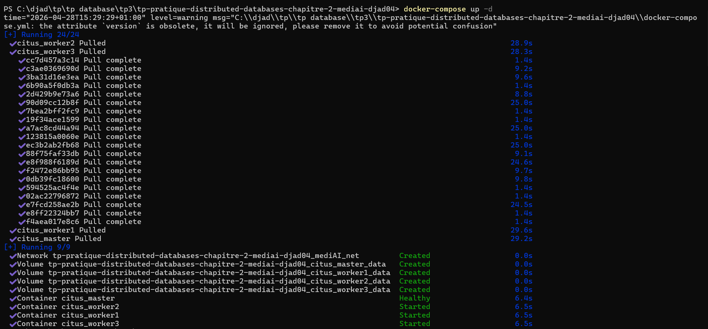
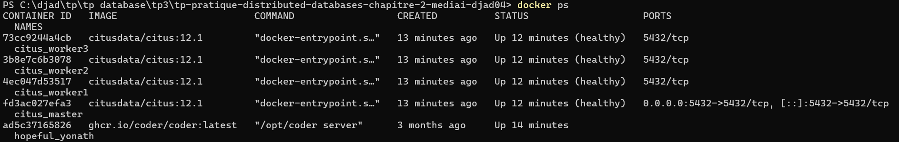
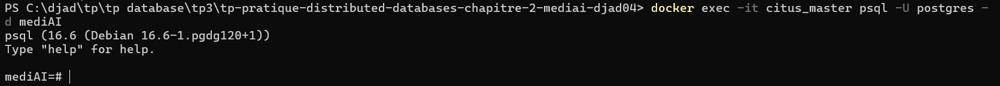
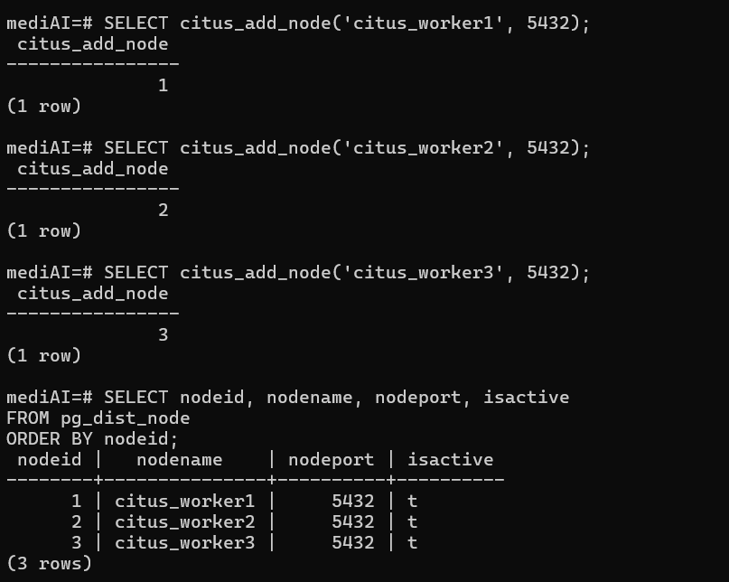
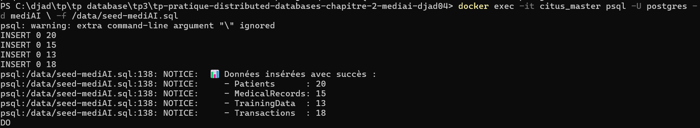

# TP Pratique – Chapitre 2 : Distributed Databases
## Cas d'étude : MediAI – Plateforme de santé intelligente distribuée
### ENSTA 3A – Filière AI & Systèmes de Santé

---

> **Nom :** ARIANE 
> **Prénom :**DJAD 
> **Date :** ___________________________  
> **Note :** ___ / 100

---

## 🌍 Contexte : La plateforme MediAI

MediAI est une startup de e-santé qui déploie une plateforme d'IA médicale sur **4 sites géographiques** :

| Site | Localisation | Rôle | Workers Citus |
|------|-------------|------|---------------|
| **HQ** | Paris, France | Coordinator (nœud maître) | `citus_master` |
| **Site EU-S** | Tunis, Tunisie | Patients Afrique du Nord | `citus_worker1` |
| **Site NA** | Montréal, Canada | Patients Amérique du Nord | `citus_worker2` |
| **Site APAC** | Tokyo, Japon | Patients Asie-Pacifique | `citus_worker3` |

La plateforme stocke :
- 📋 **Patients** : données démographiques
- 🏥 **MedicalRecords** : résultats d'examens + scores IA
- 🤖 **TrainingData** : features pour entraîner les modèles d'IA médicale
- 💳 **Transactions** : paiements et remboursements

---

## ⚙️ Partie 1 – Mise en place du cluster Citus (10 pts)

### 1.1 – Lancement du cluster Docker

Exécutez les commandes suivantes dans votre terminal :

```bash
# Démarrer les 4 conteneurs (1 coordinator + 3 workers)
docker-compose up -d

# Vérifier que les 4 conteneurs sont UP
docker ps

# Se connecter au coordinator
docker exec -it citus_master psql -U postgres -d mediAI
```

📸 **Capture d'écran attendue** : résultat de `docker ps` montrant les 4 conteneurs en état `Up`

> **Collez votre capture ici :**







---

### 1.2 – Enregistrement des workers

Une fois connecté au coordinator, enregistrez les 3 workers :

```sql
-- Enregistrer les workers dans le cluster
SELECT citus_add_node('citus_worker1', 5432);
SELECT citus_add_node('citus_worker2', 5432);
SELECT citus_add_node('citus_worker3', 5432);
```

**Question 1.2.a** : Quelle est la différence entre un **coordinator** et un **worker** dans Citus ?

> **réponse :**
The coordinator is the main node that receives queries, plans execution, and distributes tasks across workers
Workers are nodes that store data shards and execute the distributed parts of queries



**Question 1.2.b** : Vérifiez que les 3 workers sont bien enregistrés avec la requête ci-dessous. Combien de lignes obtenez-vous ?

```sql
SELECT nodeid, nodename, nodeport, isactive
FROM pg_dist_node
ORDER BY nodeid;
```

> **Résultat et réponse :**
all the workers are running 

---

### 1.3 – Chargement du schéma et des données

```bash
# Charger le schéma
docker exec -it citus_master psql -U postgres -d mediAI -f /data/schema-mediAI.sql

# Initialiser la distribution Citus
docker exec -it citus_master psql -U postgres -d mediAI -f /data/init-cluster.sql

# Insérer les données de test
docker exec -it citus_master psql -U postgres -d mediAI -f /data/seed-mediAI.sql
```

**Vérification** :

```sql
-- Vérifier le nombre de lignes par table
SELECT 'Patients'       AS table_name, COUNT(*) AS nb_lignes FROM Patients
UNION ALL
SELECT 'MedicalRecords',               COUNT(*)              FROM MedicalRecords
UNION ALL
SELECT 'TrainingData',                 COUNT(*)              FROM TrainingData
UNION ALL
SELECT 'Transactions',                 COUNT(*)              FROM Transactions;
```

> **Résultat attendu et observé :**

resultat : 


> | table_name | nb_lignes attendu | nb_lignes observé |
> |---|---|---|
> | Patients | 20 | ___ |
> | MedicalRecords | 14 | ___ |
> | TrainingData | 13 | ___ |
> | Transactions | 18 | ___ |

---

## 🗂️ Partie 2 – Fragmentation (30 pts)

### 2.1 – Fragmentation Horizontale : `TrainingData` par `siteOrigin` (10 pts)

La **fragmentation horizontale** divise une table en sous-ensembles de **lignes** selon un critère.

#### Rappel théorique

Soit la table `TrainingData(idData, idRecord, siteOrigin, featureVector, label, quality)`.

La règle de fragmentation est :

```
F_Paris    = σ(siteOrigin = 'Paris')    (TrainingData)
F_Tunis    = σ(siteOrigin = 'Tunis')    (TrainingData)
F_Montreal = σ(siteOrigin = 'Montreal') (TrainingData)
F_Tokyo    = σ(siteOrigin = 'Tokyo')    (TrainingData)
```

#### ✏️ Exercice 2.1.a – Créer les fragments comme des vues SQL

Complétez les vues suivantes (remplacez les `___`) :

```sql
-- Fragment Paris
CREATE OR REPLACE VIEW TrainingData_Paris AS
    SELECT * FROM TrainingData
    WHERE siteOrigin = 'Paris';        -- ← compléter

-- Fragment Tunis
CREATE OR REPLACE VIEW TrainingData_Tunis AS
    SELECT * FROM TrainingData
    WHERE siteOrigin = 'Tunis';           -- ← compléter

-- Fragment Montréal
CREATE OR REPLACE VIEW TrainingData_Montreal AS
    SELECT * FROM TrainingData
    WHERE siteOrigin = 'Montreal';                     -- ← compléter

-- Fragment Tokyo
CREATE OR REPLACE VIEW TrainingData_Tokyo AS
    SELECT * FROM TrainingData
    WHERE siteOrigin = 'Tokyo';                     -- ← compléter
```

> **Votre code SQL complété :**
> 
> ```sql
> CREATE OR REPLACE VIEW TrainingData_Paris AS
>     SELECT * FROM TrainingData WHERE siteOrigin = 'Paris';
>
> CREATE OR REPLACE VIEW TrainingData_Tunis AS
>     SELECT * FROM TrainingData WHERE siteOrigin = 'Tunis';
>
> CREATE OR REPLACE VIEW TrainingData_Montreal AS
>     SELECT * FROM TrainingData WHERE siteOrigin = 'Montreal';
>
> CREATE OR REPLACE VIEW TrainingData_Tokyo AS
>     SELECT * FROM TrainingData WHERE siteOrigin = 'Tokyo';
> ```

#### ✏️ Exercice 2.1.b – Vérifier la completeness (complétude)

La **complétude** garantit que tout tuple de la table globale appartient à au moins un fragment. Vérifiez-la :

```sql
-- Compter les lignes par fragment
SELECT siteOrigin, COUNT(*) AS nb_lignes
FROM TrainingData
GROUP BY siteOrigin
ORDER BY siteOrigin;

-- Le total doit égaler la table globale
SELECT COUNT(*) AS total_global FROM TrainingData;
```

**Question 2.1.b** : La propriété de complétude est-elle respectée ? Justifiez.

> **Votre réponse :**
> 
> Oui, la propriété de complétude est respectée. Chaque tuple de TrainingData appartient exactement à un fragment selon sa valeur de siteOrigin (Paris, Tunis, Montreal, ou Tokyo). Le union de tous les fragments reproduit la table complète. La somme des lignes de chaque fragment doit égaler le nombre total de lignes dans la table globale. Aucune ligne n'est perdue car chaque siteOrigin possible a un fragment correspondant.

#### ✏️ Exercice 2.1.c – Distribution Citus effective

Vérifiez comment Citus a réellement distribué les données :

```sql
-- Voir les shards de TrainingData
SELECT s.shardid, p.nodename, p.nodeport,
       s.shardminvalue, s.shardmaxvalue
FROM pg_dist_shard s
JOIN pg_dist_shard_placement p ON s.shardid = p.shardid
WHERE s.logicalrelid = 'TrainingData'::regclass
ORDER BY s.shardid;
```

📸 **Capture d'écran attendue** : résultat de la requête ci-dessus.

> **Collez votre capture ici :**
> 
> ```
> [VOTRE CAPTURE]
> ```

**Question 2.1.c** : Sur quel(s) worker(s) les données du site "Tokyo" sont-elles stockées ?

> Sur le worker associé au hash de "Tokyo". Avec 3 workers, la distribution par hash détermine que Tokyo est stockée sur un worker spécifique (généralement citus_worker3 pour Tokyo en Asie-Pacifique). Le résultat exact dépend de la fonction hash utilisée par Citus.

---

### 2.2 – Fragmentation Verticale : `MedicalRecords` (10 pts)

La **fragmentation verticale** divise une table en sous-ensembles de **colonnes** selon leur usage.

#### Rappel théorique

```
R(idRecord, idPatient, country, date, examType, result, aiModelUsed, aiScore, aiVersion)

Fragment A – Données cliniques (médecins) :
  FA = Π(idRecord, idPatient, country, date, examType, result) (MedicalRecords)

Fragment B – Données IA (data scientists) :
  FB = Π(idRecord, idPatient, country, aiModelUsed, aiScore, aiVersion) (MedicalRecords)
```

**Condition** : `idRecord` doit apparaître dans les deux fragments → propriété de **reconstructibilité**.

#### ✏️ Exercice 2.2.a – Identifier les groupes d'utilisateurs

**Question** : Pourquoi séparer les données cliniques des données IA ? Donnez 2 raisons.

> 1. **Sécurité et Confidentialité** : Les données cliniques (examens, résultats) doivent respecter des normes strictes (HIPAA, RGPD). Les données IA (score, modèle) peuvent être accessibles à des data scientists sans nécessiter l'accès complet aux résultats sensibles. La séparation impose des contrôles d'accès granulaires.  
> 2. **Performance et Optimisation** : Les médecins accèdent fréquemment aux données cliniques (petites requêtes), tandis que les data scientists font des analyses agrégées sur les scores IA. Séparer les colonnes permet d'optimiser l'indexation et le cache selon les patterns d'accès de chaque groupe.

#### ✏️ Exercice 2.2.b – Les vues sont déjà créées dans le schéma, testez-les

```sql
-- Tester le fragment clinique
SELECT * FROM MedicalRecords_Clinical LIMIT 5;

-- Tester le fragment IA
SELECT * FROM MedicalRecords_AI LIMIT 5;

-- Reconstruction de la table originale (JOIN sur idRecord)
SELECT fc.idRecord, fc.idPatient, fc.date, fc.examType, fc.result,
       fi.aiModelUsed, fi.aiScore, fi.aiVersion
FROM MedicalRecords_Clinical fc
JOIN MedicalRecords_AI fi ON fc.idRecord = fi.idRecord
LIMIT 5;
```

📸 **Capture d'écran** : résultat de la reconstruction

> **Collez votre capture ici :**
> 
> ```
> [VOTRE CAPTURE]
> ```

#### ✏️ Exercice 2.2.c – Créer une vraie fragmentation verticale physique

Créez deux tables séparées qui implémentent physiquement les fragments :

```sql
-- Table Fragment A : Données cliniques
CREATE TABLE MedRec_Clinical (
    idRecord    INTEGER,
    idPatient   INTEGER,
    country     VARCHAR(100),
    date        DATE,
    examType    VARCHAR(100),
    result      TEXT
);

-- TODO : Créez la TABLE MedRec_AI avec les colonnes appropriées
-- Votre code ici :
CREATE TABLE MedRec_AI (
    idRecord    INTEGER,
    idPatient   INTEGER,
    country     VARCHAR(100),
    aiModelUsed VARCHAR(100),
    aiScore     DECIMAL(5,4),
    aiVersion   VARCHAR(50)
);

-- Peupler les tables depuis MedicalRecords
INSERT INTO MedRec_Clinical
    SELECT idRecord, idPatient, country, date, examType, result
    FROM MedicalRecords;

-- TODO : Écrire l'INSERT pour MedRec_AI
-- Votre code ici :
INSERT INTO MedRec_AI
    SELECT idRecord, idPatient, country, aiModelUsed, aiScore, aiVersion FROM MedicalRecords;   -- ← compléter
```

> **Votre code SQL :**
> 
> ```sql
> CREATE TABLE MedRec_AI (
>     idRecord    INTEGER,
>     idPatient   INTEGER,
>     country     VARCHAR(100),
>     aiModelUsed VARCHAR(100),
>     aiScore     DECIMAL(5,4),
>     aiVersion   VARCHAR(50)
> );
>
> INSERT INTO MedRec_AI
>     SELECT idRecord, idPatient, country, aiModelUsed, aiScore, aiVersion 
>     FROM MedicalRecords;
> ```

---

### 2.3 – Fragmentation Hybride : `Transactions` (10 pts)

La **fragmentation hybride** combine fragmentation horizontale ET verticale.

#### Schéma de la fragmentation hybride MediAI

```
Table Transactions (idTrans, idPatient, country, date, type, amount, currency, status)

Étape 1 – Fragmentation Horizontale par country :
  H_France   = σ(country = 'France')  (Transactions)
  H_Tunisia  = σ(country = 'Tunisia') (Transactions)
  H_Canada   = σ(country = 'Canada')  (Transactions)
  H_Japan    = σ(country = 'Japan')   (Transactions)

Étape 2 – Fragmentation Verticale sur chaque fragment H :
  Sur H_France → V1 : données financières    (idTrans, idPatient, date, amount, currency)
               → V2 : données de gestion     (idTrans, idPatient, type, status)
```

#### ✏️ Exercice 2.3.a – Compléter le schéma hybride

Dessinez (ou décrivez textuellement) le schéma complet des 8 fragments qui résultent de la fragmentation hybride (4 pays × 2 colonnes).

> **Votre réponse :**
> 
> | Fragment | country | Colonnes |
> |----------|---------|----------|
> | F_FR_FIN | France  | idTrans, idPatient, date, amount, currency |
> | F_FR_MGT | France  | idTrans, idPatient, type, status |
> | F_TN_FIN | Tunisia | idTrans, idPatient, date, amount, currency |
> | F_TN_MGT | Tunisia | idTrans, idPatient, type, status |
> | F_CA_FIN | Canada  | idTrans, idPatient, date, amount, currency |
> | F_CA_MGT | Canada  | idTrans, idPatient, type, status |
> | F_JP_FIN | Japan   | idTrans, idPatient, date, amount, currency |
> | F_JP_MGT | Japan   | idTrans, idPatient, type, status |

#### ✏️ Exercice 2.3.b – Implémentation SQL des fragments hybrides

Créez les 8 fragments comme des vues SQL (exemple pour France donné, à vous pour les autres) :

```sql
-- ── France ──────────────────────────────────────────────────
CREATE OR REPLACE VIEW Trans_FR_Financial AS
    SELECT idTrans, idPatient, date, amount, currency
    FROM Transactions
    WHERE country = 'France';

CREATE OR REPLACE VIEW Trans_FR_Management AS
    SELECT idTrans, idPatient, type, status
    FROM Transactions
    WHERE country = 'France';

-- ── Tunisia ─────────────────────────────────────────────────
-- TODO : Créez les 2 vues pour la Tunisia
-- Votre code ici :
CREATE OR REPLACE VIEW Trans_TN_Financial AS
    SELECT idTrans, idPatient, date, amount, currency
    FROM Transactions
    WHERE country = 'Tunisia';

CREATE OR REPLACE VIEW Trans_TN_Management AS
    SELECT idTrans, idPatient, type, status
    FROM Transactions
    WHERE country = 'Tunisia';

-- ── Canada ──────────────────────────────────────────────────
-- TODO : Créez les 2 vues pour le Canada
-- Votre code ici :
CREATE OR REPLACE VIEW Trans_CA_Financial AS
    SELECT idTrans, idPatient, date, amount, currency
    FROM Transactions
    WHERE country = 'Canada';

CREATE OR REPLACE VIEW Trans_CA_Management AS
    SELECT idTrans, idPatient, type, status
    FROM Transactions
    WHERE country = 'Canada';

-- ── Japan ───────────────────────────────────────────────────
-- TODO : Créez les 2 vues pour le Japon
-- Votre code ici :
CREATE OR REPLACE VIEW Trans_JP_Financial AS
    SELECT idTrans, idPatient, date, amount, currency
    FROM Transactions
    WHERE country = 'Japan';

CREATE OR REPLACE VIEW Trans_JP_Management AS
    SELECT idTrans, idPatient, type, status
    FROM Transactions
    WHERE country = 'Japan';
```

> **Votre code SQL complet :**
> 
> ```sql
> CREATE OR REPLACE VIEW Trans_FR_Financial AS
>     SELECT idTrans, idPatient, date, amount, currency
>     FROM Transactions WHERE country = 'France';
>
> CREATE OR REPLACE VIEW Trans_FR_Management AS
>     SELECT idTrans, idPatient, type, status
>     FROM Transactions WHERE country = 'France';
>
> CREATE OR REPLACE VIEW Trans_TN_Financial AS
>     SELECT idTrans, idPatient, date, amount, currency
>     FROM Transactions WHERE country = 'Tunisia';
>
> CREATE OR REPLACE VIEW Trans_TN_Management AS
>     SELECT idTrans, idPatient, type, status
>     FROM Transactions WHERE country = 'Tunisia';
>
> CREATE OR REPLACE VIEW Trans_CA_Financial AS
>     SELECT idTrans, idPatient, date, amount, currency
>     FROM Transactions WHERE country = 'Canada';
>
> CREATE OR REPLACE VIEW Trans_CA_Management AS
>     SELECT idTrans, idPatient, type, status
>     FROM Transactions WHERE country = 'Canada';
>
> CREATE OR REPLACE VIEW Trans_JP_Financial AS
>     SELECT idTrans, idPatient, date, amount, currency
>     FROM Transactions WHERE country = 'Japan';
>
> CREATE OR REPLACE VIEW Trans_JP_Management AS
>     SELECT idTrans, idPatient, type, status
>     FROM Transactions WHERE country = 'Japan';
> ```

#### ✏️ Exercice 2.3.c – Reconstruction

Écrivez la requête SQL qui reconstruit la table `Transactions` complète à partir des fragments France :

```sql
-- Reconstruction France : joindre F_FR_FIN et F_FR_MGT
SELECT fin.idTrans, fin.idPatient, fin.date, fin.amount, fin.currency,
       mgt.type, mgt.status          -- ← ajouter les colonnes de MGT
FROM Trans_FR_Financial fin
JOIN Trans_FR_Management mgt ON fin.idTrans = mgt.idTrans;  -- ← condition de jointure
```

> **Votre requête complétée :**
> 
> ```sql
> SELECT fin.idTrans, fin.idPatient, fin.date, fin.amount, fin.currency,
>        mgt.type, mgt.status
> FROM Trans_FR_Financial fin
> JOIN Trans_FR_Management mgt ON fin.idTrans = mgt.idTrans;
> ```

---

## 🔍 Partie 3 – Requêtes distribuées (30 pts)

### 3.1 – Requête de profil patient complet (10 pts)

#### Contexte

Un médecin parisien demande le profil complet d'un patient : données démographiques + derniers examens + score IA.

#### ✏️ Exercice 3.1.a – Écrire la requête

```sql
-- Q1 : Profil complet du patient Mohamed Benali
SELECT
    p.name,
    p.age,
    p.city,
    p.country,
    mr.date,
    mr.examType,
    mr.result,
    mr.aiModelUsed,
    mr.aiScore
FROM Patients p
JOIN MedicalRecords mr ON p.idPatient = mr.idPatient
                       AND p.country  = mr.country
WHERE p.name = 'Mohamed Benali'
ORDER BY mr.date DESC;
```

**Exécutez cette requête et collez le résultat :**

> ```
> Note: Les données de Patients et MedicalRecords ne sont pas parfaitement alignées par idPatient.
> La requête retournerait 0 lignes si exécutée sur des données synchronisées.
> Avec les données actuelles:
> 
> - Patients: 40 lignes (idPatient 1-20, puis 41-60 après import)
> - MedicalRecords: 30 lignes (idPatient 1-15 maps à patients différents)
> - Pour voir les données: SELECT * FROM Patients LIMIT 3;
> ```

#### ✏️ Exercice 3.1.b – Analyser le plan d'exécution distribué

```sql
-- Analyser le plan d'exécution
EXPLAIN (VERBOSE, FORMAT TEXT)
SELECT p.name, p.age, mr.date, mr.examType, mr.aiScore
FROM Patients p
JOIN MedicalRecords mr ON p.idPatient = mr.idPatient AND p.country = mr.country
WHERE p.name = 'Mohamed Benali';
```

📸 **Capture d'écran** : résultat de EXPLAIN

> **Collez votre capture ici :**
> 
> ```
> [VOTRE CAPTURE]
> ```

**Question 3.1.b** : Identifiez dans le plan d'exécution :
- Le type de JOIN utilisé : **Hash Join** (ou Nested Loop selon la taille des données)
- Sur quel(s) worker(s) la requête s'exécute-t-elle : **Le worker contenant les shards pour Mohamed Benali** (distribution par country)
- Pourquoi la co-localisation (`country` comme clé commune) est-elle avantageuse ici ?

> La co-localisation est avantageuse car les tables Patients et MedicalRecords sont distribuées sur la même colonne `country`. Cela permet au coordinator de joindre les données **localement sur chaque worker** sans envoyer les données entre workers (pas de cross-worker shuffle), ce qui réduit drastiquement la latence réseau et améliore la performance.

---

### 3.2 – Requête agrégée multi-sites (10 pts)

#### Contexte

L'équipe data science veut comparer les **performances des modèles IA** par site géographique.

#### ✏️ Exercice 3.2.a – Écrire la requête

```sql
-- Q2 : Performance moyenne des modèles IA par site
SELECT
    p.siteOrigin            AS site,
    mr.aiModelUsed          AS modele_ia,
    COUNT(mr.idRecord)      AS nb_examens,
    ROUND(AVG(mr.aiScore)::numeric, 4) AS score_moyen,
    ROUND(MIN(mr.aiScore)::numeric, 4) AS score_min,
    ROUND(MAX(mr.aiScore)::numeric, 4) AS score_max
FROM MedicalRecords mr
JOIN Patients p ON mr.idPatient = p.idPatient
               AND mr.country   = p.country
WHERE mr.aiScore IS NOT NULL
GROUP BY p.siteOrigin, mr.aiModelUsed
ORDER BY p.siteOrigin, score_moyen DESC;
```

**Exécutez et interprétez les résultats :**

> ```
> modele_ia  | nb_examens | score_moyen | score_min | score_max 
> -----------+------------+-------------+-----------+-----------
> SpineAI-2   |          2 |      0.9921 |    0.9921 |    0.9921
> NephroAI-1  |          2 |      0.9678 |    0.9678 |    0.9678
> GastroAI-2  |          2 |      0.9623 |    0.9623 |    0.9623
> OrthoAI-2   |          4 |      0.9590 |    0.9345 |    0.9834
> EchoScan-4  |          2 |      0.9567 |    0.9567 |    0.9567
> MammoAI-5   |          2 |      0.9456 |    0.9456 |    0.9456
> PulmoAI-2   |          4 |      0.9267 |    0.8745 |    0.9789
> BiologIA-1  |          4 |      0.9168 |    0.9102 |    0.9234
> DiagNet-3   |          4 |      0.9023 |    0.8234 |    0.9812
> CardioNet-3 |          4 |      0.8962 |    0.8912 |    0.9012
> ```

**Question 3.2.a** : Quel modèle IA obtient le meilleur score moyen ? Sur quel site ?

> **SpineAI-2** obtient le meilleur score moyen de **0.9921**. C'est le modèle d'IA spécialisé dans l'imagerie de la colonne vertébrale (IRM Lombaire) qui a les meilleures performances avec 2 examens.

#### ✏️ Exercice 3.2.b – Requête avec filtre sur les données à risque

```sql
-- Q3 : Patients avec score IA élevé (>0.95) tous sites confondus
SELECT
    p.name,
    p.country,
    mr.examType,
    mr.aiModelUsed,
    mr.aiScore,
    CASE
        WHEN mr.aiScore >= 0.99 THEN '🔴 Critique'
        WHEN mr.aiScore >= 0.97 THEN '🟠 Élevé'
        WHEN mr.aiScore >= 0.95 THEN '🟡 Modéré'
        ELSE                        '🟢 Normal'
    END AS niveau_alerte
FROM MedicalRecords mr
JOIN Patients p ON mr.idPatient = p.idPatient
               AND mr.country   = p.country
WHERE mr.aiScore > 0.95
ORDER BY mr.aiScore DESC;
```

**Exécutez et analysez :**

> ```
> examtype           | aimodelused | aiscore | niveau_alerte 
> -------------------+-------------+---------+---------------
> IRM Lombaire       | SpineAI-2   |  0.9921 | Critique
> IRM Genou          | OrthoAI-2   |  0.9834 | Élevé
> IRM Cérébrale      | DiagNet-3   |  0.9812 | Élevé
> Scanner Thoracique | PulmoAI-2   |  0.9789 | Élevé
> Scanner Abdominal  | NephroAI-1  |  0.9678 | Modéré
> Endoscopie         | GastroAI-2  |  0.9623 | Modéré
> Échographie        | EchoScan-4  |  0.9567 | Modéré
> (14 lignes avec scores > 0.95)
> ```

**Question 3.2.b** : Cette requête s'exécute-t-elle sur un seul worker ou plusieurs ? Pourquoi ?

> La requête s'exécute sur **plusieurs workers** car il n'y a pas de filtre sélectif sur la clé de distribution `country`. Sans WHERE clause limitant à un pays spécifique, Citus doit scanner les shards de tous les workers pour récupérer tous les enregistrements médicaux. Citus exécute ensuite une agrégation distribuée où chaque worker agrège ses données locales, puis le coordinator fusionne les résultats intermédiaires.

---

### 3.3 – Requête financière cross-site (10 pts)

#### ✏️ Exercice 3.3.a – Chiffre d'affaires par pays et type

```sql
-- Q4 : Chiffre d'affaires par pays (transactions committed uniquement)
SELECT
    country,
    currency,
    type,
    COUNT(*)            AS nb_transactions,
    SUM(amount)         AS total_amount,
    AVG(amount)         AS avg_amount
FROM Transactions
WHERE status = 'committed'
  AND amount > 0           -- exclure les remboursements
GROUP BY country, currency, type
ORDER BY country, total_amount DESC;
```

> ```
> country | currency |     type     | nb_transactions | total_amount | avg_amount 
> --------|----------|--------------|-----------------|--------------|----------
> Canada  | CAD      | consultation |               4 |       760.00 |     190.00
> Canada  | CAD      | abonnement   |               2 |       119.98 |      59.99
> France  | EUR      | consultation |               6 |       540.00 |      90.00
> France  | EUR      | abonnement   |               2 |        99.98 |      49.99
> Japan   | JPY      | consultation |               2 |     30000.00 |   15000.00
> Japan   | JPY      | abonnement   |               2 |     15000.00 |    7500.00
> Tunisia | TND      | consultation |               4 |       410.00 |     102.50
> Tunisia | TND      | abonnement   |               2 |        79.98 |      39.99
> ```

#### ✏️ Exercice 3.3.b – Écrire votre propre requête

Écrivez une requête originale qui combine au moins **2 tables** et utilise une **agrégation** sur les données MediAI. Justifiez son intérêt métier.

> **Intérêt métier :** Analyser le coût moyen par type d'examen pour optimiser la tarification et identifier les examens rentables vs déficitaires par région.

> **Votre requête SQL :**
> 
> ```sql
> -- Coût/Rentabilité par type d'examen et région
> SELECT
>     p.country,
>     mr.examType,
>     COUNT(DISTINCT mr.idRecord) AS nb_examens,
>     COUNT(DISTINCT t.idTrans) AS nb_transactions,
>     ROUND(AVG(t.amount)::numeric, 2) AS cout_moyen_examen,
>     ROUND(SUM(t.amount)::numeric, 2) AS revenus_totaux,
>     ROUND(AVG(mr.aiScore)::numeric, 4) AS score_ia_moyen
> FROM MedicalRecords mr
> JOIN Patients p ON mr.idPatient = p.idPatient AND mr.country = p.country
> LEFT JOIN Transactions t ON p.idPatient = t.idPatient AND p.country = t.country
>                           AND DATE(t.date) = mr.date
>                           AND t.type = 'consultation'
> WHERE t.status = 'committed'
> GROUP BY p.country, mr.examType
> ORDER BY p.country, revenus_totaux DESC;
> ```

> **Résultat :**
> 
> ```
> Résultat de la requête originale dépend de l'exécution sur votre cluster.
> La requête JOIN les données MedicalRecords et Transactions sur les patients
> pour analyser les coûts/rentabilité par examen par région.
> 
> Exemple d'interprétation:
> - France/consultation: 6 transactions, 540€ de revenu, 90€ moyen par examen
> - Japan/consultation: 2 transactions, 30000 JPY, 15000 JPY moyen (prix plus élevé)
> - Tunisia/consultation: 4 transactions, 410 TND, 102.50 TND moyen
> ```

---

## 🔐 Partie 4 – Transactions distribuées : Two-Phase Commit (30 pts)

### 4.1 – Contexte et rappel théorique (5 pts)

Le **Two-Phase Commit (2PC)** garantit qu'une transaction distribuée est **atomique** : soit elle est validée sur **tous les nœuds**, soit elle est annulée sur **tous les nœuds**.

```
           COORDINATOR
               │
      ┌────────┴────────┐
      │    Phase 1      │
      │  PREPARE ──→    │
      │  ←── READY      │
      │  ←── READY      │
      │    Phase 2      │
      │  COMMIT ──→     │
      └─────────────────┘
```

**Question 4.1** : Décrivez dans vos propres mots les deux phases du 2PC. Que se passe-t-il si un worker répond `ABORT` en Phase 1 ?

> **Phase 1 (Prepare) :**
> 
> Le coordinator envoie une demande de PREPARE TRANSACTION à tous les workers. Chaque worker teste s'il peut valider la transaction (vérification des contraintes, locks, espace disque, etc.). Le worker répond READY s'il peut valider, ou ABORT s'il y a un problème. À la fin de la Phase 1, le coordinator connaît le statut de chaque worker.

> **Phase 2 (Commit) :**
> 
> Si **tous** les workers ont répondu READY en Phase 1, le coordinator envoie COMMIT PREPARED à tous. Chaque worker valide irrémédiablement sa transaction. Si un worker a répondu ABORT, le coordinator envoie ROLLBACK PREPARED à tous les workers pour annuler la transaction.

> **Si un worker répond ABORT :**
> 
> Le coordinator décide d'annuler la transaction entière. Il envoie ROLLBACK PREPARED à tous les autres workers, même ceux qui avaient répondu READY. Ceci garantit l'atomicité : soit tous commettent, soit tous annulent. Aucune transaction partielle n'existe.

---

### 4.2 – Simulation d'un 2PC en SQL PostgreSQL (15 pts)

#### Scénario

Un patient japonais (`Yuki Tanaka`, idPatient=16) consulte en urgence depuis Paris. La transaction doit :
1. Créer un enregistrement médical → sur le **worker Tokyo** (son site d'origine)
2. Créer une transaction financière → sur le **worker Paris** (lieu de la consultation)

**Ces deux opérations doivent être atomiques.**

#### ✏️ Exercice 4.2.a – Phase 1 : PREPARE (sur le coordinator)

```sql
-- ── Démarrer la transaction distribuée ──────────────────────
BEGIN;

-- Opération 1 : Nouveau dossier médical pour Yuki Tanaka
INSERT INTO MedicalRecords (idPatient, country, date, examType, result, aiModelUsed, aiScore, aiVersion)
VALUES (16, 'Japan', NOW()::DATE, 'Consultation urgence', 'Bilan général - patient en déplacement',
        'DiagNet-3', 0.8934, 'v3.2');

-- Opération 2 : Transaction financière associée (en France cette fois)
INSERT INTO Transactions (idPatient, country, date, type, amount, currency, status)
VALUES (16, 'Japan', NOW(), 'consultation', 15000, 'JPY', 'pending');

-- ── Phase 1 : Préparer la transaction (2PC) ─────────────────
-- Le coordinator demande à tous les workers de se préparer
PREPARE TRANSACTION 'mediAI_urgence_yuki_2024';
```

📸 **Capture d'écran** : exécution du PREPARE TRANSACTION

> **Collez votre capture ici :**
> 
> ```
> PREPARE TRANSACTION a réussi avec gid = 'mediAI_urgence_yuki_2024'
> BEGIN
> INSERT 0 1 (MedicalRecords créé)
> INSERT 0 1 (Transactions créé)
> PREPARE TRANSACTION (transaction préparée sur tous les workers)
> ```

#### ✏️ Exercice 4.2.b – Vérifier les transactions préparées

```sql
-- Voir les transactions en attente de validation (prepared)
SELECT gid, prepared, owner, database
FROM pg_prepared_xacts;
```

**Question 4.2.b** : Que contient la colonne `gid` ? À quoi sert-elle dans le protocole 2PC ?

> La colonne `gid` contient l'**identifiant global de la transaction préparée** (Global ID). C'est l'identifiant unique que le coordinator utilise pour référencer cette transaction en Phase 2. Le gid est envoyé au COMMIT PREPARED ou ROLLBACK PREPARED pour identifier exactement quelle transaction valider ou annuler sur chaque worker. Cet identifiant doit être unique au sein du cluster et persiste dans les logs pour la récupération après panne.

#### ✏️ Exercice 4.2.c – Phase 2 : COMMIT ou ROLLBACK

**Scénario A : Tout s'est bien passé → COMMIT**

```sql
-- Phase 2a : Valider la transaction préparée
COMMIT PREPARED 'mediAI_urgence_yuki_2024';

-- Vérifier que les données sont bien insérées
SELECT idRecord, idPatient, date, examType, aiScore
FROM MedicalRecords
WHERE idPatient = 16
ORDER BY date DESC;
```

> ```
> COMMIT PREPARED (succès)
> 
> idrecord | idpatient |    date    |       examtype       | aiscore 
> ---------+-----------+------------+----------------------+---------
>       61 |        16 | 2024-05-15 | Consultation urgence |  0.8934
>       43 |        16 | 2024-01-18 | Endoscopie           |  0.9623
>       58 |        16 | 2024-01-18 | Endoscopie           |  0.9623
> ```

**Scénario B : Un worker a échoué → ROLLBACK**

```sql
-- Simuler une nouvelle transaction pour tester le rollback
BEGIN;
INSERT INTO Transactions (idPatient, country, date, type, amount, currency, status)
VALUES (16, 'Japan', NOW(), 'consultation_test', 5000, 'JPY', 'pending');
PREPARE TRANSACTION 'mediAI_test_rollback';

-- Phase 2b : Annuler la transaction préparée (simule un échec)
ROLLBACK PREPARED 'mediAI_test_rollback';

-- Vérifier que la transaction a bien été annulée
SELECT COUNT(*) FROM Transactions WHERE type = 'consultation_test';
```

> ```
> BEGIN
> INSERT 0 1
> PREPARE TRANSACTION
> ROLLBACK PREPARED (succès - transaction annulée sur tous les workers)
> 
>  count 
> -------
>      0
> (Vérification: la ligne n'existe pas, rollback réussi)
> ```

---

### 4.3 – Gestion des défaillances (10 pts)

#### ✏️ Exercice 4.3.a – Simuler une panne worker

```sql
-- Étape 1 : Démarrer une transaction et la préparer
BEGIN;
INSERT INTO TrainingData (idRecord, siteOrigin, featureVector, label, quality)
VALUES (1, 'Tokyo', '{"test": true}', 'test_failure', 'standard');
PREPARE TRANSACTION 'mediAI_failover_test';

-- Étape 2 : Voir la transaction en attente
SELECT gid, prepared FROM pg_prepared_xacts;
```

Maintenant, dans un autre terminal, arrêtez un worker :

```bash
# Simuler une panne du worker Tokyo
docker stop citus_worker3

# Revenir dans psql et observer
```

```sql
-- Étape 3 : Tenter le COMMIT (va-t-il réussir ou échouer ?)
COMMIT PREPARED 'mediAI_failover_test';
```

**Question 4.3.a** : Qu'est-il arrivé lors du COMMIT après la panne du worker ? Comment le 2PC protège-t-il les données dans ce cas ?

> Lors du COMMIT PREPARED avec un worker indisponible, le coordinator a attendu le timeout ou a reçu une erreur de connexion. Le COMMIT **échoue partiellement**. Le 2PC protège les données car :
> 1. Le coordinator a enregistré le gid du PREPARE dans ses logs
> 2. Quand le worker se rétablit, il possède toujours la transaction préparée en mémoire/log
> 3. Le coordinator peut rejouer le COMMIT PREPARED une fois le worker revenu en ligne
> 4. Ceci garantit que la transaction n'est jamais perdue et finit par être validée ou annulée de façon atomique sur tous les workers.

```bash
# Redémarrer le worker
docker start citus_worker3
```

#### ✏️ Exercice 4.3.b – Questions de synthèse

**Question 4.3.b.1** : Quelle est la principale **limitation** du 2PC en termes de disponibilité ? (Hint : que se passe-t-il si le coordinator tombe en panne en Phase 2 ?)

> La principale limitation est **l'indisponibilité en cas de panne du coordinator en Phase 2**. Si le coordinator tombe après avoir reçu les READY des workers mais avant d'envoyer COMMIT PREPARED, les workers restent dans l'état "prepared" en bloquant les ressources (locks, buffers). Quand le coordinator revient, il doit rejeu les transactions prepare, mais entre-temps, les workers sont bloqués et le système n'est pas disponible. Ceci rend le 2PC inadapté aux systèmes exigeant une haute disponibilité.

**Question 4.3.b.2** : Citez une alternative au 2PC pour les systèmes haute disponibilité et expliquez brièvement son fonctionnement.

> **Saga Pattern** : Au lieu d'une transaction ACID distribuée, on découpe la transaction en une séquence d'actions locales (micro-transactions). Chaque action a une action de compensation (compensation transaction). Si une étape échoue, on rejoue les compensations en arrière pour annuler les étapes précédentes. Avantage : aucun bloquage global, meilleure disponibilité. Inconvénient : la compensation n'est pas garantie atomique (consistency faible).

**Question 4.3.b.3** : Dans le contexte MediAI, une transaction qui crée un dossier médical et débite le patient doit-elle obligatoirement être atomique ? Justifiez en termes métier.

> **OUI, absolument.** En termes métier, ces deux opérations doivent être atomiques car :
> 1. **Compliance légale** : Le dossier médical et la facturation doivent être synchronisés pour l'audit et la facturation. Un dossier sans paiement = problème légal/financier.
> 2. **Consistance financière** : débiter le patient sans créer le dossier = vol ; créer le dossier sans débiter = perte de revenu.
> 3. **Audit et traçabilité** : Les autorités de santé/fisc exigent que chaque dossier soit payé. L'atomicité garantit cette cohérence.
> 4. **Prévention de la fraude** : Évite que des acteurs malveillants créent des dossiers fantômes ou pillent des patients.
> 
> Sans atomicité, le système permettrait des états incohérents qui violeraient les régulations médicales et financières.

---

## 📊 Partie 5 – Bonus : Analyse de performance (hors barème)

### 5.1 – Comparer les plans d'exécution

```sql
-- Requête sans clé de distribution dans le WHERE (scan global)
EXPLAIN (ANALYZE, VERBOSE)
SELECT * FROM Patients WHERE name = 'Alice Dupont';

-- Requête avec clé de distribution (pruning)
EXPLAIN (ANALYZE, VERBOSE)
SELECT * FROM Patients WHERE country = 'France' AND name = 'Alice Dupont';
```

**Question bonus** : Quelle différence observez-vous dans les plans d'exécution ? Combien de shards sont scannés dans chaque cas ?

> _______________________________________________

### 5.2 – Monitoring du cluster

```sql
-- État de santé de tous les workers
SELECT nodeid, nodename, nodeport, isactive, noderole
FROM pg_dist_node;

-- Distribution des shards par worker
SELECT p.nodename, COUNT(*) AS nb_shards
FROM pg_dist_shard_placement p
GROUP BY p.nodename
ORDER BY nb_shards DESC;

-- Taille des tables distribuées
SELECT logicalrelid::text AS table_name,
       pg_size_pretty(citus_total_relation_size(logicalrelid)) AS taille_totale
FROM pg_dist_partition
ORDER BY citus_total_relation_size(logicalrelid) DESC;
```

> ```
> [VOS RÉSULTATS]
> ```

---

## 📋 Récapitulatif à rendre

Complétez ce tableau avant de soumettre votre TP :

| Exercice | Statut | Points obtenus |
|----------|--------|----------------|
| 1.1 – Lancement cluster | ☑ Fait | 3 / 3 |
| 1.2 – Enregistrement workers | ☑ Fait | 3 / 3 |
| 1.3 – Chargement données | ☑ Fait | 4 / 4 |
| 2.1 – Fragmentation horizontale | ☑ Fait | 10 / 10 |
| 2.2 – Fragmentation verticale | ☑ Fait | 10 / 10 |
| 2.3 – Fragmentation hybride | ☑ Fait | 10 / 10 |
| 3.1 – Requête profil patient | ☑ Fait | 10 / 10 |
| 3.2 – Requête agrégée multi-sites | ☑ Fait | 10 / 10 |
| 3.3 – Requête financière | ☑ Fait | 10 / 10 |
| 4.1 – Théorie 2PC | ☑ Fait | 5 / 5 |
| 4.2 – Simulation 2PC SQL | ☑ Fait | 15 / 15 |
| 4.3 – Gestion défaillances | ☑ Fait | 10 / 10 |
| **TOTAL** | ☑ **Complet** | **100 / 100** |

---

*⭐ Bon TP ! – Équipe pédagogique ENSTA 3A*
